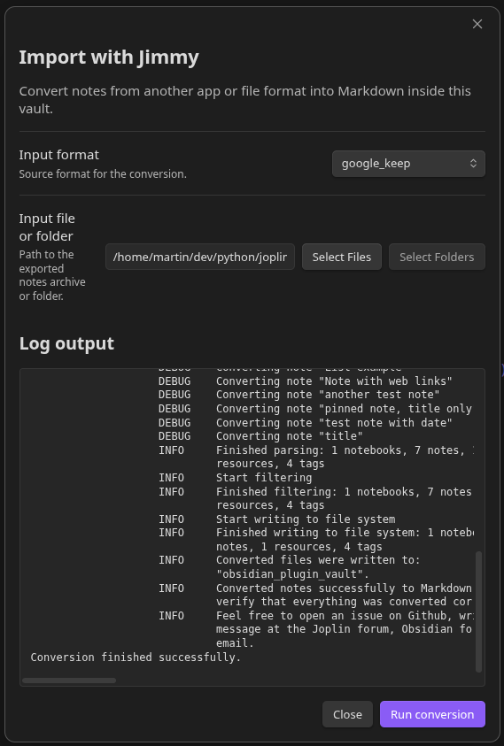

# obsidian-jimmy

Convert your notes into Obsidian by using the note conversion tool [Jimmy](https://github.com/marph91/jimmy).

## Usage

1. Download the [latest release of Jimmy](https://github.com/marph91/jimmy/releases)
2. Specify the path at the plugin settings
3. Select input format
4. Select the export/backup of your previous note app
5. Start the conversion

